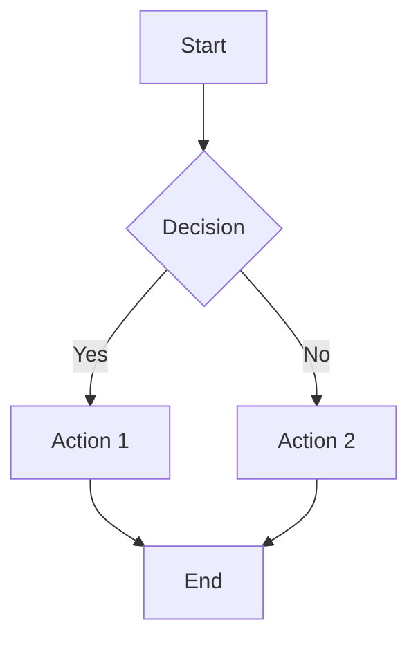
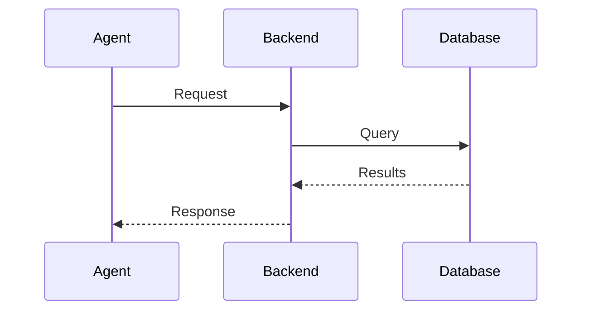
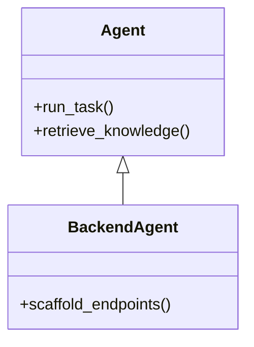
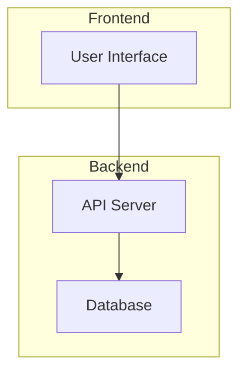
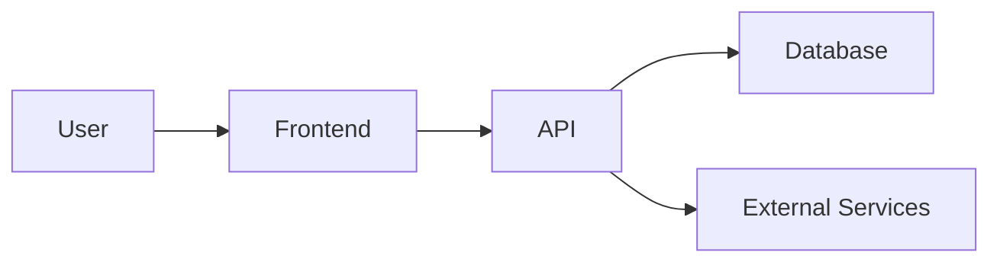

# Mermaid Diagram Templates

## Flowchart

```mermaid
flowchart TD
    A[Start] --> B{Decision}
    B -->|Yes| C[Action 1]
    B -->|No| D[Action 2]
    C --> E[End]
    D --> E
```

## Sequence Diagram

```mermaid
sequenceDiagram
    participant A as Agent
    participant B as Backend
    participant D as Database
    
    A->>B: Request
    B->>D: Query
    D-->>B: Results
    B-->>A: Response
```

## Class Diagram

```mermaid
classDiagram
    class Agent {
        +run_task()
        +retrieve_knowledge()
    }
    class BackendAgent {
        +scaffold_endpoints()
    }
    Agent <|-- BackendAgent
```

## Component Diagram

```mermaid
graph TB
    subgraph "Frontend"
        UI[User Interface]
    end
    subgraph "Backend"
        API[API Server]
        DB[Database]
    end
    UI --> API
    API --> DB
```

## Architecture Diagram

```mermaid
flowchart LR
    User --> Frontend
    Frontend --> API
    API --> Database
    API --> External[External Services]
```

